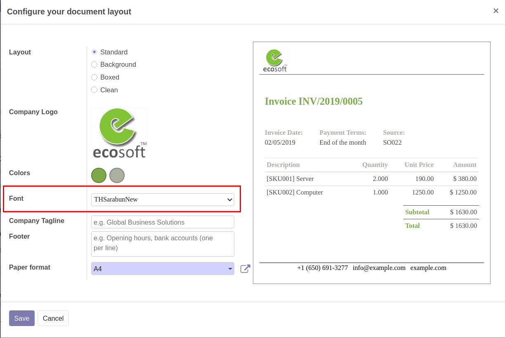
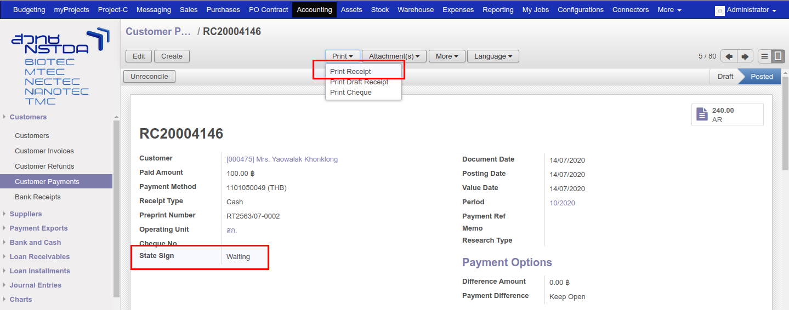
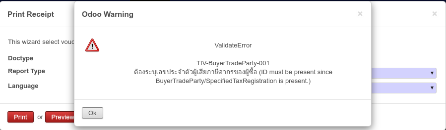

# Functional
---

## การออกเลข Pre-print ในระบบ {#Heading1}
เมื่อทำการติดตั้งโมดูล pabi_ir_sequence_preprint ระบบ PABI2 จะสามารถสร้างหมายเลข Pre-print เมื่อเอกสารใบนั้นกำลังจะทำการบันทึกภาษี โดยที่ไม่ต้องใช้หมายเลขจากกระดาษ Pre-print ซึ่งจะมีรูปแบบหมายเลขดังนี้

* Receipt Tax Invoice : รูปแบบ RT<ปีปฏิทิน>/<เดือนปฏิทิน>-<หมายเลข 4 หลัก> เช่น RT2563/08-0001
* Invoice Tax : รูปแบบ IVT<ปีปฏิทิน>/<เดือนปฏิทิน>-<หมายเลข 4 หลัก> เช่น IVT2563/08-0001

### การตั้งค่าระบบการออกหมายเลข Pre-print {#Heading1_1}

* ไปที่เมนู Settings > Technical > Sequences & Identifiers
* จะพบว่ามีเมนูใหม่เพิ่มขึ้นมา คือ Sequence Preprint ให้เลือกเอกสารที่ต้องการแก้ไข

{: .center-image }

* หมายเลข 1 คือ การแสดง <หมายเลข> จำนวนกี่หลัก
* หมายเลข 2 คือ การเพิ่มขึ้นของ <หมายเลข> ครั้งละเท่าไหร่
* หมายเลข 3 คือ การแสดง <ปีปฏิทิน> เป็น พุทธศักราช (พ.ศ.) หากไม่เลือกระบบจะแสดงเป็น คริสต์ศักราช (ค.ศ.)
* หมายเลข 4 คือ การแบ่งการสร้างหมายเลขถัดไป
* หมายเลข 5 คือ การสร้างหมายเลขใหม่ทุกๆเดือน หากไม่เลือกระบบจะสร้างหมายเลขใหม่ทุกๆปี
* หมายเลข 6 คือ ระยะเวลาในการสร้างหมายเลข เมื่อเลยช่วงระยะเวลา ระบบจะสร้างของเดือนถัดไปให้อัตโนมัติ (กรณีเลือกข้อ 5)

### วิธีการเรียกใช้ Pre-print ในระบบ {#Heading1_2}

* คล้ายกับการเรียก Sequence เดิม คือ เรียกโดยใช้ function next_by_id หรือ next_by_code ได้ โดยจะต้องเรียก module ที่ชื่อว่า ir.sequence.preprint สามารถดูตัวอย่างการเรียกใช้ Pre-print ได้ที่ ./pb2_addons/l10n_th_account_tax_detail/models/account_tax_detail.py ใน function _create_sequence_preprint

## การตั้งค่าการเชื่อมต่อในระบบ PABI2 {#Heading2}

เมื่อทำการติดตั้งโมดูล pabi_docsign_interface ให้ไปที่เมนู: Settings > Configuration > PABI Web. จะเห็นว่าในระบบมีการตั้งค่าเพิ่มเติมในหัวข้อ e-Tax Webservice Configuration 

{: .center-image }

* ซึ่งจะมีรายละเอียดการตั้งค่าดังนี้

    * หมายเลข 1 : กรอก URL ของ Docsign Server
    * หมายเลข 2 : กรอก URL ของ Docsign Server สำหรับทดสอบ
    * หมายเลข 3 : กรอกชื่อ Database ของ Docsign Server
    * หมายเลข 4 : กรอก username
    * หมายเลข 5 : กรอก password

โดยระบบจะเช็คก่อนว่ามีการใส่ URL สำหรับทดสอบหรือไม่ ถ้ามีจะส่งไปที่ URL สำหรับทดสอบ แต่ถ้าไม่มี จะส่งไปที่ URL Docsign Server ปกติ

## การตั้งค่าการเชื่อมต่อ Docsign Server ไปยัง i-net {#Heading3}
หลังจากได้รับ key จริงแล้ว ทาง สวทช. จะต้องมาแก้ไขที่ระบบ Server เพื่อให้ระบบส่งข้อมูลไปให้ i-net โดยมีขั้นตอนการตั้งค่าดังนี้

1. ไปที่เมนู Settings > Technical > Parameters > System Parameters
2. ข้อมูลที่ขึ้นต้นด้วย webservice ทั้งหมดจะได้รับจากทาง i-net

{: .center-image }

3. ปัจจุบันข้อมูลที่ใช้เป็น webservice ที่สำหรับทดสอบเท่านั้น เมื่อได้รับข้อมูลจาก i-net แล้วสามารถแก้ไขข้อมูลในส่วนนี้ให้ถูกต้อง

## การแก้ไขการแสดงฟอนต์ผิดพลาดในรายงาน {#Heading4}

หากเจอกรณีที่มีการปริ้นเอกสารแล้วระบบแสดงผลผิดพลาด
สามารถแก้ไขโดยการอัพเกรดโมดูล web 

{: .center-image }

{: .center-image }

## การเปลี่ยนฟอนต์ของเอกสาร {#Heading5}
สามารถเปลี่ยนฟอนต์เป็นไทยสารบัญได้โดยมีขั้นตอนการตั้งค่าดังนี้ 

1. ไปที่เมนู Settings > Business Documents > Configure Document Layout
2. เลือกฟอนต์ THSarabunNew

{: .center-image }

## การส่งเอกสารในระบบ PABI2 เพื่อลงลายมือชื่ออิเล็กทรอนิกส์ {#Heading6}
เอกสารที่ระบบ Docsign Server รองรับมีทั้งหมด 5 ประเภท คือ

1. ใบแจ้งหนี้
2. ใบเสร็จรับเงิน / ใบกำกับภาษี
3. ใบเสร็จรับเงิน / ใบกำกับภาษี 300% (ในระบบ PABI2 คือ 200%)
4. ใบลดหนี้ / ใบกำกับภาษี
5. ใบส่งของ / ใบกำกับภาษี (ส่งจาก mySale)

วิธีการลงลายมือชื่ออิเล็กทรอนิกส์

1. ไปที่เมนู Accounting > Customers > Customer Payments
2. ที่หน้าเอกสารจะมี Field เพิ่มขึ้นมาชื่อว่า State Sign เพื่อบอกสถานะการลงลายมือชื่ออิเล็กทรอนิกส์ของเอกสารนั้น ๆ
3. Print > Print Receipt

    {: .center-image }

    

4. ที่หน้า Print จะมีปุ่มเพิ่มขึ้นมา 3 ปุ่มคือ Preview, Sign และ Update Sign

    * Preview คือ การสร้างเอกสารใน Docsign Server และส่งกลับมาที่ระบบต้นทาง โดยจะไม่มีการลงลายมือชื่ออิเล็กทรอนิกส์ เพื่อให้ผู้ใช้งานเห็นเอกสารก่อนที่จะลงลายมือชื่ออิเล็กทรอนิกส์
    * Sign คือ การสร้างเอกสารใน Document Server และส่งข้อมูลทั้งหมดไปลงลายมือชื่ออิเล็กทรอนิกส์ ก่อนที่จะส่งกลับมาที่ต้นทาง
    * Update Sign จะเห็นแทนปุ่ม Sign เมื่อเอกสารนั้นเคยลงลายมือชื่ออิเล็กทรอนิกส์ไปแล้ว ใช้สำหรับการแก้ไขข้อมูลในเอกสารนั้น

    {: .center-image }

    

5. เลือกฟอร์มที่ต้องการลงลายมือชื่ออิเล็กทรอนิกส์ ถ้าฟอร์มที่เลือกนั้นไม่สามารถลงลายมือชื่ออิเล็กทรอนิกส์ได้ระบบจะขึ้น Error ซึ่งเอกสารที่รองรับการลงลายมือชื่ออิเล็กทรอนิกส์ สามารถดูได้จากด้านบน

    {: .center-image }

    

6. กรณีต้องการดูตัวอย่างเอกสารก่อนลงลายมือชื่ออิเล็กทรอนิกส์จริง สามารถคลิกที่ปุ่ม Preview แล้วระบบจะสร้างเอกสารให้ที่ Attachment File

    {: .center-image }

    

7. เมื่อตรวจสอบข้อมูลถูกต้องแล้วสามารถคลิกปุ่ม Sign ได้เลย ซึ่งในระบบจะยืนยันการทำรายการอีกทีหนึ่ง 

ถ้าระบบลงลายมือชื่ออิเล็กทรอนิกส์สำเร็จ กรณีมีเอกสารที่เคย Preview ไว้จะหายไป และมีเอกสารที่ลงลายมือชื่ออิเล็กทรอนิกส์สำเร็จมาแทนที่ หากไม่เคย Preview จะพบว่ามีเอกสารไฟล์แนบเพิ่มขึ้นมา ซึ่งจะเก็บในรูปแบบ URL Link 

กรณีที่มีการลงลายมือชื่ออิเล็กทรอนิกส์ผิดพลาด ระบบจะแสดงข้อความ Error ประมาณนี้

{: .center-image }

สาเหตุหลัก ๆ ที่จะทำเกิด Error นั้น ส่วนใหญ่เกิดจากการที่ระบบต้นทางไม่มีข้อมูลบางส่วนที่ docsign server ต้องการ ซึ่งในที่นี้คือ ลูกค้าไม่มีข้อมูลเลขประจำตัวผู้เสียภาษี ก็ให้ไปทำการเพิ่มเลขประจำตัวผู้เสียภาษีที่ลูกค้า แล้วให้ลองอีกครั้งหนึ่ง

อีกสาเหตุที่มีโอกาสเกิดคือ เอกสารที่ทำรายการไม่มี Product และ Product Code มีการเว้นช่องว่างไว้ 1 วรรค ทำให้ระบบ Error ได้

## การยกเลิกเอกสารในระบบ PABI2 และลงลายมือชื่ออิเล็กทรอนิกส์ {#Heading7}

การยกเลิกเอกสารลงลายมือชื่ออิเล็กทรอนิกส์ในระบบ PABI2 จะสามารถทำได้ 3 วิธีคือ

1. การยกเลิกเอกสารด้วยวิธียกเลิกเอกสารใบเดิม
2. การยกเลิกเอกสารด้วยวิธีการลดหนี้ (Credit Note)
3. การยกเลิกเอกสารด้วยวิธีการออกใบใหม่ทดแทน

### การยกเลิกเอกสารด้วยวิธียกเลิกเอกสารใบเดิม {#Heading7_1}

ในกรณีที่ต้องการยกเลิกเอกสารที่เคยลงลายมือชื่ออิเล็กทรอนิกส์ไปแล้ว สามารถยกเลิกได้ตามขั้นตอนดังนี้

1. ไปที่เมนู Accounting > Customers > Customer Payment
2. เลือกเอกสารที่ต้องการยกเลิก ถ้ามีการจ่ายผ่าน Bank ไปแล้วให้ยกเลิกเอกสาร RV ตามกระบวนการปกติก่อน
3. ไปที่เอกสารใบเสร็จที่ต้องการยกเลิก (RC) > กดปุ่ม Unreconcile เพื่อทำการกลับรายการ

    {: .center-image }
        :align: center

4. Print > Print Receipt > เลือกประเภทเอกสารที่ต้องการยกเลิกประเภทเดียวกับที่ลงลายมือชื่ออิเล็กทรอนิกส์ไว้ก่อนหน้า

    {: .center-image }
    
    .. note::
        กรณีที่ต้องการยกเลิกเอกสารประเภท Tax Receipt และ Tax Receipt 200% จะต้องใส่เหตุผล
        ที่ช่อง Reason for cancellation ด้วย โดยเหตุผลที่กรอกจะเป็นประเภทเดียวกับการลดหนี้ (Credit Note)

5. กดปุ่ม Cancel Sign และยืนยันการยกเลิกเอกสาร ระบบจะส่งเอกสารไปทำการยกเลิกเอกสารใบนั้นให้

### การยกเลิกเอกสารด้วยวิธีการลดหนี้ (Credit Note) {#Heading7_2}

ในกรณีที่มีการทำใบลดหนี้และต้องการลงลายมือชื่ออิเล็กทรอนิกส์ มีขั้นตอนดังนี้

1. ทำกระบวนการรับเงิน (Customer Payment) แล้วมีการลงลายมือชื่ออิเล็กทรอนิกส์ไปแล้ว
2. ตรวจสอบพบจำนวนเงินไม่ถูกต้อง หรือข้อมูลผิดต้องการออกใบลดหนี้ให้ลูกค้า
3. ไปที่เมนู Accounting > Customers > Customer Invoices
4. ค้นหาเอกสารใบแจ้งหนี้ที่ต้องการออกใบลดหนี้ > กดปุ่ม Refund Invoice
5. ระบบจะออกเอกสารใบลดหนี้ (CN) > แก้ไขข้อมูลให้ถูกต้อง แล้วทำตามกระบวนการลดหนี้ปกติ
6. Print > Print Invoice > กรอกสาเหตุที่ต้องการออกใบลดหนี้ > กดปุ่ม Sign

    {: .center-image }

    .. note::
        เอกสารใบลดหนี้จะต้องมาจากการกดปุ่ม Refund Invoice เท่านั้น
        หากเป็นการสร้างตรงจะไม่สามารถทำการลงลายมือชื่ออิเล็กทรอนิกส์ได้

### การยกเลิกเอกสารด้วยวิธีการออกใบใหม่ทดแทน {#Heading7_3}

ในกรณีที่มีการลงลายมือชื่ออิเล็กทรอนิกส์ไปแล้ว แต่ต้องการแก้ไขข้อมูลไม่มากนัก เช่น ชื่อผิด ที่อยู่ผืด

1. ไปที่เอกสารที่มีข้อมูลผิดพลาด (Customer Invoice, Customer Payment)
2. Print > Print Invoice, Print Receipt
3. กรอกสาเหตุที่ต้องการออกเอกสารใบใหม่ทดแทนใบเดิม > Update Sign